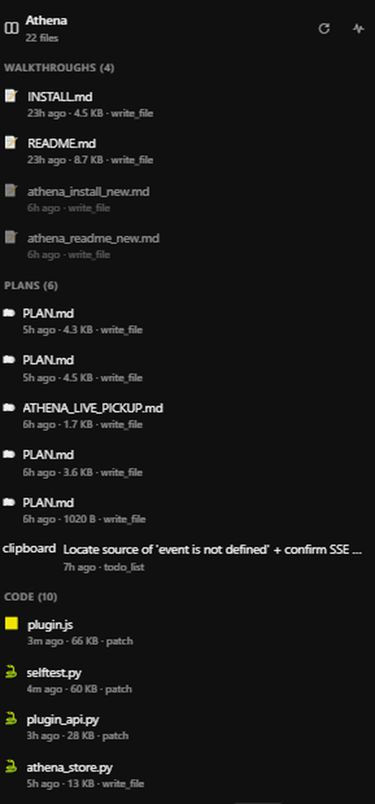
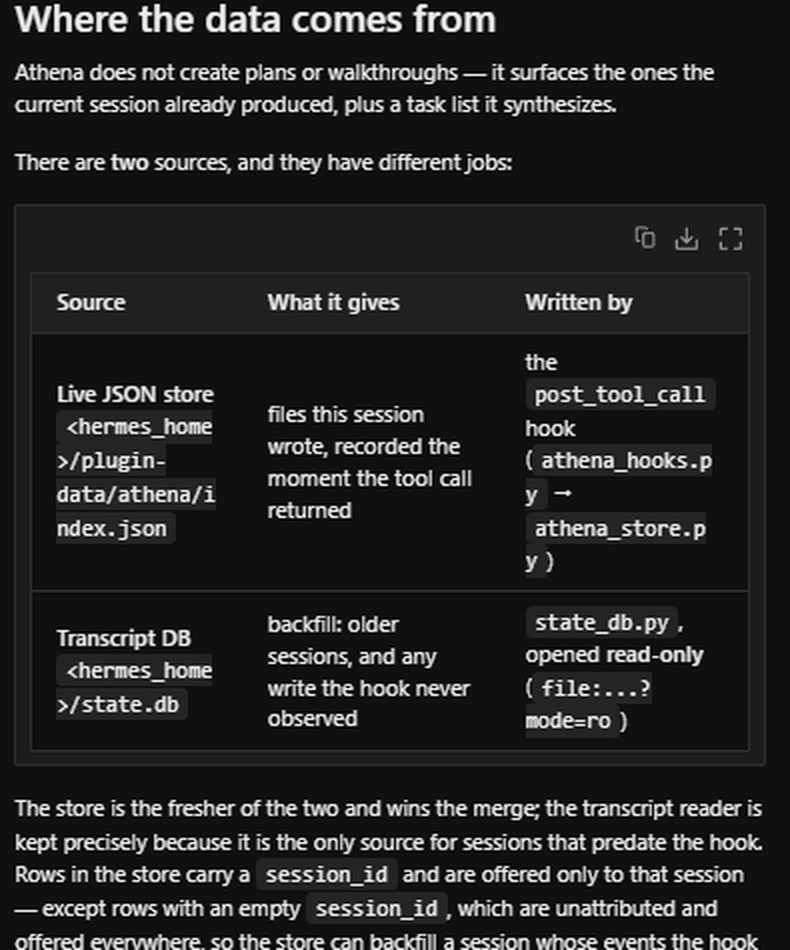
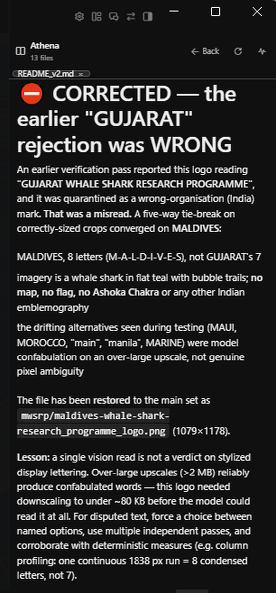

<p align="center">
  
</p>

# Athena

Right-side Hermes Desktop panel for the focused session's artifacts.

- Inline viewers: **markdown**, **code** (line numbers), **images**, **sandboxed HTML**
- **Live checklist** of the session task list, synthesized from the transcript
- Grouped list: Docs, Walkthroughs, Plans, Code, Data, Media, Other
- **Session search** and the **All-sessions** full tab
- Filter/search, tab strip, live indexing
- **Live** indexing via a `post_tool_call` hook + JSON store, backfilled
  from Hermes' own read-only SQLite transcript store

> **Installs on a stock Hermes — no rebuild required.** Everything above works
> by copying the plugin in and reloading desktop plugins. One optional extra
> (an "Open in Athena" button on file cards in the chat) needs a small change to
> Hermes Desktop; see
> [Optional: the file-card button](#optional-the-file-card-button).

## Screenshots

### Grouped artifact list

Every file the session produced, grouped by kind, with age, size, and the tool
that wrote it. Read-only tools never appear here — only actual output.



### Inline viewer

Click a row and the document opens beside the list — rendered, not dumped as raw
text. Tables, code fences and long lines reflow to the pane width, so a wide
document stays readable in a narrow panel.



### Beside the conversation

Athena docks to the right of the chat, so the transcript and the artifacts stay
side by side. Back steps through what you opened; Refresh re-reads from disk.



## Where the data comes from

Athena does not create plans or walkthroughs — it surfaces the ones the current
session already produced, plus a task list it synthesizes.

There are **two** sources, and they have different jobs:

| Source | What it gives | Written by |
|---|---|---|
| **Live JSON store** `<hermes_home>/plugin-data/athena/index.json` | files this session wrote, recorded the moment the tool call returned | the `post_tool_call` hook (`athena_hooks.py` → `athena_store.py`) |
| **Transcript DB** `<hermes_home>/state.db` | backfill: older sessions, and any write the hook never observed | `state_db.py`, opened **read-only** (`file:...?mode=ro`) |

The store is the fresher of the two and wins the merge; the transcript reader is
kept precisely because it is the only source for sessions that predate the hook.
Rows in the store carry a `session_id` and are offered only to that session —
except rows with an empty `session_id`, which are unattributed and offered
everywhere, so the store can backfill a session whose events the hook missed.

### The `post_tool_call` hook

`register(ctx)` wires `athena_hooks.on_post_tool_call` into Hermes' observer
hook. It records two deliberately narrow things:

- **`write_file` / `patch`** — their *arguments* name the file being written.
- **`execute_code` / `terminal` / `browser_vision` / `text_to_speech`** — these
  produce files without naming them, so only a `MEDIA:` marker in the *result*
  counts. That is how Hermes hands an image or audio file back to the client.

Read-only tools (`read_file`, `grep`, `search_files`, …) are never watched, and a
call with `status` of `error` / `failed` / `blocked` is skipped. The hook never
raises and never writes user content — it only appends a path string to the JSON
store. `/index` then pushes every recorded path through the *same* containment and
credential-denial gates the transcript path uses, so a recorded `.ssh/id_rsa` or an
out-of-home path is recorded but never served.

Store mechanics: atomic writes (tmp file + `os.replace`), case-insensitive dedupe
by path, re-recording is an upsert that preserves `pinned`, and `MAX_ITEMS = 200`
`hook_items` (contributed) and `hook_refused` (dropped by the safety gates) plus
the resolved store path.

Two facts drive the transcript reader's design:

| Fact | Consequence |
|---|---|
| Hermes stores transcripts in SQLite, **not** the JSONL dirs `<home>/webui/sessions` / `<home>/sessions` | Athena reads `messages` rows. Those JSONL dirs are empty on a real install. |
| Tool **arguments** are the authoritative record of what a session produced | Paths come from `messages.tool_calls`; `messages.content` is scanned too, to catch files written by `execute_code` / subagents. |

A tool-only task list has no file on disk, so Athena **synthesizes** a virtual
artifact:

```
path        plan://<session-id>
kind        plan
group       Plans
label       <first pending task, else the newest task>
task_count  total tasks
task_done   completed tasks
tasks[]     { id, label, status } in composer order
```

`/file?path=plan://…` serves that checklist as JSON, and the pane renders it as
a checklist with a progress bar and per-status glyphs (✓ completed, ▶ in
progress, ⚠ blocked, ○ pending). Because the route is polled, ticking a task off
in the composer flips its row in Athena without a refresh.

## Routes

| Route | Purpose |
|---|---|
| `/health` | liveness + whether `state.db` was found |
| `/index?session=<id>` | artifacts for one session, grouped; includes the virtual checklist entry |
| `/file?session=<id>&path=<path>` | one artifact's content; `plan://…` returns the checklist JSON |
| `/events?session=<id>` | SSE mirror of `/index` |

Mounted at `/api/plugins/athena/…` behind the `X-Hermes-Session-Token` gate.

Live updates are **polling** (15s for `/index`, 15s for the open file's body).
The plugin renderer does not guarantee an `EventSource` global, and
`ctx.rest(path)` returns a Promise, not a URL — an SSE attempt produced a
`ReferenceError` at runtime. `/events` exists for curl and for a future
subscriber, but the pane does not depend on it.

## Install

1. Enable the plugin:
   ```bash
   hermes plugins enable athena
   hermes plugins show athena        # expect: Status: enabled
   ```

2. **Sync the desktop half** (canonical source → the copy the app loads):
   ```bash
   cp plugins/athena/desktop/plugin.js desktop-plugins/athena/plugin.js
   ```

3. Reload desktop plugins from the app (**required after any plugin change** —
   this is what activates the `post_tool_call` hook in the running backend):
   <kbd>⌘K</kbd> → *Reload desktop plugins*

4. Open Athena from the right pane, the sidebar, or `/athena`.

> **Required:** the backend must run in **dashboard** mode. A headless
> `hermes serve` sets `HERMES_SERVE_HEADLESS=1`, which unmounts plugin API
> routes and returns
> `404: Headless backend (hermes serve): web UI disabled`. Use `hermes dashboard`.

**No rebuild of Hermes Desktop is needed.** Steps 1–4 are the whole install. If
you have never rebuilt the app from source, Athena still works completely — see
[Optional: the file-card button](#optional-the-file-card-button) for the one
convenience that does require it.

## Opening a file in Athena from the chat

**Everything in Athena works on a stock Hermes install — no rebuild, no core
patch.** The plugin is self-contained: copy it in, reload desktop plugins, done.

The *extra* "Open in Athena" button on file cards is a separate, optional
convenience that needs a small change to Hermes Desktop itself. See
[Optional: the file-card button](#optional-the-file-card-button).

| Entry point | Needs a Hermes rebuild? | Opens |
|---|---|---|
| **Athena's own list** — click any artifact row | **No** | that file |
| **`::athena{path="…"}`** directive chip | **No** | that file |
| **"Open in Athena" button on a file card** | **Yes** — see below | that file |
| **Tool-result card button** | **Yes** — see below | the session list |

The first two need nothing but the plugin. They are the supported path.

### Example 1 — click a row in the artifact list

The default way in. Open Athena from the right pane, the sidebar, or
`/athena`, and click any row. The pane selects it, opens it as a tab, and
re-polls the file body every 15 seconds. No rebuild required.

### Example 2 — `::athena{path="…"}`

Any assistant message can carry a directive chip. Athena validates the path
client-side, then the backend refuses anything that is not absolute, contains a
`..` segment, names a credential directory, or resolves outside the Hermes home.
No rebuild required.

```md
Agents can now draft the discovery report themselves.

::athena{path="<hermes_home>/spec.md"}
```

### Example 3 — tool-result card

A tool-result artifact card exposes only `kind`, `language`, and `title`, and
renders the tool's inline fence content — it carries **no file path**. So its
button reveals Athena's session list rather than opening a nonexistent file.

```md
# Tool-result artifact card
ArtifactDetection = { kind: 'markdown', language: 'markdown', title: 'plan' }
<!-- no path behind this card -->
```

## Optional: the file-card button

The "Open in Athena" button rendered on a file card in the transcript
(`1 file changed / myfile.md / +12 / Review`) is a **contribution area**
(`fileCard.actions`) that Hermes Desktop must actually mount.

On a stock install it does not. Athena still registers the contribution, so
nothing errors — there is simply no `<Slot>` for it to render into, and the
button stays invisible. This is the intended failure mode: a missing button
rather than a broken pane.

To get the button, Hermes Desktop needs two small additive changes:

1. **Export the area** — `FILE_CARD_ACTIONS_AREA = 'fileCard.actions'` from
   `src/sdk/areas.ts` (and re-export it from the SDK barrel).
2. **Mount it per file row** — a `<Slot area={FILE_CARD_ACTIONS_AREA}
   context={{ path, name }} />` in
   `src/components/assistant-ui/thread/changed-files-card.tsx`, placed as a
   **sibling** of that row's own `<button>` (nesting would emit
   `<button><button>`, which is invalid, and the click would bubble into
   opening the diff).

Change 2 is why `Slot` grew an optional `context` prop: the area renders once
per file, so a contribution has to be told *which* row it is in. The change is
backwards compatible — `render(context?)` is optional and every existing
contribution keeps working untouched.

**This requires rebuilding Hermes Desktop.** These are core `.tsx`/`.ts` files,
so <kbd>⌘K</kbd> → *Reload desktop plugins* is not enough; the app itself must be
rebuilt and restarted. Until you do, the button will not appear — and that is
fine, because the artifact list and the `::athena{path="…"}` directive already
cover every case without a rebuild.

## Left-side tab: All-sessions

The left-side tab is always rendered and always shows **every session** the
focused profile has touched. The search bar above filters across that whole set;
the "All sessions" button hides the focused session and shows the full feed.

The list has a live artifact count per session and is sorted newest first.
Tap a row to open that session's artifacts as a tab.

## Verify

```bash
cd plugins/athena
python selftest.py        # offline; no live server needed
node --check desktop/plugin.js
hermes plugins show athena
```

After changing **any** plugin file, run **Reload desktop plugins** in the app
(<kbd>⌘K</kbd> → *Reload desktop plugins*), or restart Hermes. The backend module
is cached in the running process, so neither the new hook nor a changed
`/index` shows up until the reload.

The selftest builds a **temp SQLite fixture** (not the live DB) and asserts the
read-only reader, tasklist parsing for every argument shape seen in the wild
(`todos.item`, bare `todos`, JSON-string `tasks`, `title`/`content` keys),
`/index` grouping, the `plan://` payload, and the `/file` safety rules. It also
reads the live DB read-only when present.

## Safety

Athena is strictly read-only and refuses to serve anything outside the Hermes
home:

- Every path must **resolve** inside `<hermes_home>` (traversal, absolute
  outside paths, and case variants are rejected).
- Credential paths (`.ssh`, `.aws`, `.gnupg`, `.azure`, `.kube`, `vault`,
  `mcp-tokens`, `id_rsa`, …) are dropped from the index **entirely** — listing
  them even as non-openable would leak the existence and filename of a key.
- Files over 2 MB are refused.
- `state.db` is only ever opened `mode=ro`; no journal/locking pragmas are set.
- HTML previews render in a sandboxed `<iframe>`; markdown is escaped before
  rendering.
- Toolchain/runtime noise (`node_modules`, `__pycache__`, `*.db-wal`, lock
  files, …) is filtered by whole path segment, so real files like
  `distribute.md` are not dropped.
